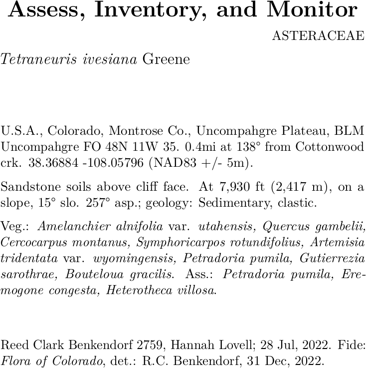

--- 
title: 'BarnebyLives: an R package to create herbarium specimen labels and clean spreadsheets'
author:  |
    | Reed Clark Benkendorf$^1$$^,$$^2$^[Author for Correspondence: rbenkendorf@chicagobotanic.org], Jeremie B. Fant$^1$$^,$$^2$
    |  $^1$Chicago Botanic Garden, 1000 Lake Cook Road, Glencoe, Illinois 60022, USA  
    |  $^2$Plant Biology and Conservation, Northwestern University, Evanston, Illinois 60208, USA  
abstract: |
  \noindent
  **Premise:** Depositing specimens in herbaria is a time-consuming process. Many institutions have reduced the amount of funding for herbaria and universities have reduced the amount of education dedicated to collections and curatorial tasks. However, the continual generation of herbarium specimens is essential for current and future research on ecology, evolution, and conservation. To facilitate the continued growth of herbaria, BarnebyLives was developed as a tool to supplement collection notes, perform geographic and taxonomic information processing, enact spell checks and other QC steps, produce labels, and submit digital data to increase the ease of accessioning specimens.  
  **Methods and Results:** BarnebyLives uses geospatial data from the U.S. The Census Bureau for administrative jurisdictional data, and other sources, including the United States Geological Survey, to supplement collection notes by providing information on abiotic site conditions and locality information. It uses in-house spell checks to verify the spelling of a collection at all taxonomic ranks, the IPNI standard author database to check standard author abbreviations, and the Royal Botanic Garden Kews 'Plants of the World Online' to check for nomenclature innovations. Optionally, the package writes driving directions to the sites using Google Maps. The package outputs data in tabular and spatial formats for review by the user before rendering labels using LaTeX.        
  **Conclusions:** BarnebyLives provides accurate political and physical information, reduces typos, provides users with current taxonomic opinions, generates driving directions to sites, and produces aesthetically pleasing labels and shipping manifests in a matter of minutes.       
keywords: |
  herbarium, natural history museum, collections, geospatial, R, LaTeX   
output:
  pdf_document: default
  toc: no
  word_document: default
csl: "../citations/american-journal-of-botany.csl"
bibliography: ../citations/citations.bib
link-citations: yes
fig_caption: yes
always_allow_html: yes
header-includes:
  - \usepackage{endfloat}
  - \usepackage{setspace}\doublespacing
  - \usepackage{lineno}
  - \linenumbers
  - \usepackage{rotating}
--- 

```{r echo = F}
knitr::opts_chunk$set(echo=F, warning = F, message = F)
```

Nearly 400 million specimens are housed worldwide in herbaria [@thiers2021herbaria]. 
However, The rate of accessioning new collections to herbaria diminished in the 20^th^ century as priorities in biology shifted away from describing and documenting earths biodiversity and towards understanding cellular and molecular processes underpinning life [@prather2004decline; @pyke2010biological; @daru2018widespread]. 
This shift, among other factors, led to a decline in the funding allocated to collection-based research, the number of staff maintaining and accessing new collections, and educating students in these practices [@funk2014erosion].
Historically, specimens have been used to describe the taxonomic diversity of plants and document global floristic diversity [@greve2016realising; @james2018herbarium; @brewer2019factors; @ronsted2020integrative]. 
However, renewed interest in herbarium collections utilizing 'big data approaches,’ such as museuomics, has brought herbaria back to the forefront of the natural sciences [@ronsted2020integrative; @marsico2020small]. 

Innovations in specimen digitization, data sharing, computing, DNA sequencing, and statistics have perhaps brought about greater use of herbarium specimens than ever before [@greve2016realising; @james2018herbarium; @brewer2019factors; @ronsted2020integrative]. 
The current use of specimens and their ancillary data extends well beyond their traditional roles in systematics and floristics, and studies utilizing collections are regularly carried out to better understand the ecological niches, phenological processes, and interactions of plants [@ronsted2020integrative; @davis2023herbarium]. 
We suspect that collections are yet to realize their full potential, and as currently novel approaches, such as remote and electronic sensing and meta-barcoding, become more accessible the use of collections will increase [@tosa2021rapid]. 
While image-based or purely observational (rather than collection-based) citizen science approaches (e.g., iNaturalist, BudBurst) have recently dovetailed with herbarium specimens to meet many current research needs, specimens contain rich data that are not accessible via images. 
Only specimens have the ability to: provide samples of DNA, secondary metabolites, or proteins, material for measuring (micro-)morphological attributes [@borges2020schrodinger], and seeds or pollen.  These factors ensure that the specimens remain the premier botanical data source. 

However, despite renewed recognition of the utility of collections, efforts to grow them appear slow [@prather2004decline].
We conjecture that this is partly because collecting and depositing specimens is a fundamentally slower process, especially for novice collectors, relative to taking photographs via professionally developed apps on smartphones [@daru2018widespread; @mishler2020spatial; @manzano2021fair].
While many young botanists are capable of using dichotomous keys and other resources to reliably identify and collect satisfactory  material, we observed that they face difficulties navigating several aspects of data acquisition, processing, and preparation of labels for submission to herbaria.
Evidently, apparent problems include the lack of dedicated time at the end of a field season to process specimens, a general lack of education on cartography and orienteering, natural history (e.g., geology, geomorphology), nomenclature, and familiarity with various computer programs (for example, Microsoft Office suite), and increasing foundational knowledge of plant systematics and phylogenetics [@nanglu2023nature; @woodland2007botanists; @barrows2016crossroads].  

The generation of an herbarium specimen involves many steps that are easy to take for granted [@forman1989herbarium].
For example, while acquiring appropriate political information for a collection site appears simple, young collectors rarely have adequate cartographic resources (printed topographic maps or GIS software) at their disposal.
In topographically complex areas, where administrative borders are often associated with hydrological basins and the ridges defining them, collectors are liable to misinterpret their true geographic position and report details in error. 
Even finding appropriate site names can rarely be solved without a printed map, as many navigation-related software now consider many features that would serve as site names extraneous. 
Similarly, the rate at which taxonomic innovations occur, the volume of the literature, and the reluctance of some regional curators to embrace a phylogenetic approach to plant classification have made it difficult to find more recently applied names, even when these names are unanimously accepted by taxonomic specialists in the group [@hitchcock2018flora]. 
Furthermore, formatting a label correctly (e.g., author abbreviations) is a time-consuming process with many opportunities to introduce errors in formatting. 
Anecdotally, many mail merge templates offered by herbaria still require collectors to modify many variables by hand, for example, applying italicization. Even if a collector navigates all these hurdles, the time allocated to each step is quite large.  

As a result of these concerns, we have developed an R package, BarnebyLives, that aims to increase both the quality of data rendered to labels and recorded in databases and to speed up the process of producing labels.
It rapidly provides political and administrative boundary information for a collection site using data from the U.S. Census Bureau [@walker2022tigris], the Public Land Survey System (PLSS), and ownership details of public lands via the Protected-Areas Database (PAD-US) [@usgs2024padus].
Site names are suggested by finding the closest unambiguously named place feature in the Geographic Name Information System (GNIS) and the precise calculation of distance and azimuth from this feature to the collection site [@gnis2024].
Using the Global Mountain Biodiversity Assessment (GMBA) Mountain Inventory V. 2, a standardized named mountain data set with global coverage allows for a relevant descriptor of the general region with less ambiguity [@snethlage2022hierarchical].
Spell checks on all scientific names (including associated species) are performed using a copy of the World Checklist of Vascular Plants, and the resolved species may be searched via Kew's Plant of the World Online for relevant synonyms [@govaerts2021world; @powo2024]. 
Author abbreviations are verified using the International Plant Names Index (IPNI) Standard Author Abbreviation Checklist and also returned by Kew's Plants of the World Online to ensure proper abbreviations of authorities [@ipni2024; @powo2024].
Checks to search for and flag common issues associated with spreadsheet software or data transcription, such as the auto-filling of coordinate and date columns. 
After a final review of the data, flagged or generated by the package, it allows for the option to export spreadsheets that are suitable for mass uploading of data to multiple common herbarium databases as well as the generation of herbarium labels.  

Currently, label generation functionality is provided explicitly by two programs, PLabel and Symbiota, as well as by the Microsoft Word tool Mail Merge (@perkins2020Plabel, @gries2014symbiota). 
The office suite costs money, and in our experience, is finicky; further, its functionality ends with label creation. 
PLabel is a standalone program that has greatly enhanced functionality relative to a mail merge, allowing users to specify the layout and formatting of label components using an intuitive and local graphical user interface (GUI) functionality. 
However, it does not include data cleaning functionalities beyond verifying nations of collection. 
While some sources indicate that it can only be used in Microsoft, we expect it to be usable on Linux and Mac using Windows 'emulators' like Wine. 
The increasingly popular Symbiota biodiversity data management software not only provides label generation capabilities but also provides data cleaning functionality in an attractive GUI web portal allowing for live management of collections and bypassing the need for a local installation, allowing it to be accessed on all operating systems. 
Symbiota offers functionality similar to the first four of our five stages of our 'Taxonomic' module and to our knowledge a check of the 'Political Boundaries’ (see Figure 1). 
However, not all herbaria use Symbiota and many have original database systems that they maintain (for example, Harvard University Herbarium, https://kiki.huh.harvard.edu/databases/specimen_index.html; Missouri Botanical Garden https://tropicos.org/specimen/Search; and The Consortium of Pacific Northwest Herbaria https://www.pnwherbaria.org/). 
However, and most importantly many collectors prefer to generate their own labels, especially as they are likely to send different sets of collections to different institutions. 
Accordingly, the functionality of Symbiota should exist in an ecosystem with alternative systems.  In scenarios where users want to keep rendering labels in either of the three existing alternatives, they can easily export data in the appropriate formats after utilizing BLs data cleaning utilities.  

BarnebyLives was named for plant taxonomist Rupert Charles Barneby (1911-2000), who published over 6,500 pages of text, described over 750 taxa, and is notable for balancing his studies at the William and Lynda Steere Herbarium at the New York Botanical Garden with annual collection trips in Western North America from 1937-1970 and sporadically until he passed in 2000 [@welsh2001rupert]. 
Select accolades of Rupert include the 1989 Asa Gray Award from the American Society of Plant Taxonomists (ASPT), the 1991 Engler Silver Medal from the International Association of Plant Taxonomists (IAPT), as well as being one of eight recipients of the International Botanical Congress's (IBC) Millennium Botany Award (1999) [@welsh2001rupert]. 
Most germanely, Rupert was remembered as being generous with his time to assist younger botanists with the more arcane aspects of field botany and taxonomy [@holmgren2017]. 

# METHODS AND RESULTS

{width=100%}  

```{r install package, eval = F}
## devtools::install_github('sagesteppe/BarnebyLives')
```

```{r load libraries}
library(tidyverse) # data operations
library(BarnebyLives) # for helping accession collections
```

BarnebyLives was iteratively developed based on data submitted by approximately 20 seasonal field botany teams over two years. 
Essentially, continual updates were made as the developers became aware of the idiosyncrasies of collection notes and data entry.  
Several commands in BarnebyLives require output from previous functions, and a workflow that satisfies these requirements is presented in Figure 1.

## Usage
All steps of BarnebyLives, except for label generation are run within the freely available RStudio. 
Data may be read from any common spreadsheet management system or database connection such as Excel, or free alternatives such as LibreOffice, OpenOffice, or via the cloud on Google Sheets. 
The latter two options are documented here and in package vignettes, detailed descriptions of the required and suggested input columns are located on a Github page (https://github.com/sagesteppe/BarnebyLives 'Input Data Column Names') and 96 real-world examples are on a Google Sheets accessible from the page. 
BarnebyLives is atypical for R packages in that it requires a considerable amount of data to operate (Table 1). 
Virtually all on-disk memory associated with the package are used to store spatial data.
The amount of spatial data varies according to the domain that the user decides to support (Figure 3).
Functions that require on-disk data require a path to data as an argument.  Manually supplying the path argument allows users to determine an appropriate storage location suitable for their needs. 

We anticipate that for a typical user, BarnebyLives will require less than a couple gigabytes of memory (ours covering all of the conterminous Western U.S. at 3-arc second (~90m) resolution is ~16 GiB), while the processing requires relatively little RAM; hence, we believe installations can work on hardware as limited as Chromebooks, while having the data stored entirely on thumb-drives. 
The final steps of BarnebyLives, generating the labels, requires working installations of R Markdown, a LaTeX installation (e.g. [pdfTeX](https://www.tug.org/applications/pdftex/), [LuaTeX](https://www.luatex.org/), [XeLaTeX](https://www.overleaf.com/learn/latex/XeLaTeX)), and the open source command line tools [pdfjam](https://github.com/rrthomas/pdfjam) and [pdftk](https://linux.die.net/man/1/pdftk).
While these steps are run through a shell scripting language such as bash, we have wrapped them in R functions that bypass the need to enter the commands directly into a shell terminal outside of RStudio.
Unfortunately, we have not found Windows alternatives to pdfam and pdftek, so we are unable to offer the final label-generating functionality on that operating system. 

## Functionality
BarnebyLives can be thought of as consisting of five main modules (Figure 1): spatial, taxonomic, formatting, manual review, and data exporting.  

The spatial module has five required functions and two optional functions. 

*coords2sf* creates a spatially explicit simple feature (sf) geometry dataset for the input data. political_grabber determines many levels of administrative ownership, including land management and public land survey system sections.  
*physical_grabber* provides various geographic data, such as elevation, landform position, and aspect using 90m resolution spatial data.  
*political_grabber*  grabs a wide range of administrative information for a collection site. 
*site_writer*  write distance and azimuth to collection site from the nearest official named place from the GNIS database. 
*directions_grabber* is an optional function that writes driving directions from a reasonably sized town to the closest drivable area to the site using the Google Maps API, which will require a valid Google account that is free per month for most personal and smaller academic usages. 
*dms2dd* is an optional function used to convert from coordinates denoted in the degrees minutes and second format (for example, 42°08'39.9\"N 87°47'08.3\"W) to decimal degree format (for example 42.14439, -87.78569). 
*autofill_checker* searches for patterns in the input latitude and longitude data associated with autofilling from various spreadsheet programs and will emit a warning if they are encountered.  


The taxonomic module has four required functions and one optional function. 
*spell_check* will perform a spell check on the entered scientific name based on a local copy of Kew Plants of the World database filtered to the local continents or a user-specified backbone.  
*spell_check_family* performs a spell check on the family entered for each scientific name.  
*author_check* ensures that the authors are entered in a valid format, for example, the correct standard abbreviations are used.  
*associates_check* performs a spell check on all associated species using the local taxonomic database. 
*powo_searcher* can be used in tandem with the functions *spell_check_family* and *author_check*, but we use it in lieu of them to search the current Plants of the World Online to determine relevant synonyms and alternative higher taxonomy for the focal species. No API key or registration is required to use *powo_searcher*.  

The formatting module has three functions. The first two we will detail are optional; however, they are run locally and so quickly that there is no reason to skip them. 
*associate_dropper* silently removes the collected species from the list of associated species; however, it searches for the species to be removed using the scientific name entered initially by the user rather than returned via spell checks. 
*field_lengths* will emit messages for any fields that we suspect will create an 'overflow' on the physical label and should be truncated for clarity.
*date_parser* is mandatory and parses an input date into various formats for notating collection and determination dates on labels.

The manual review process technically only has one function that is optional and may be executed during the spatial process (after *coords2sf*), but the importance of manual review is important enough to warrant explicit mention. 
*geodata_writer* will write out a spatial copy of the data set to any geospatial format supported by the sf package, but defaults to writing out 'kmls' which are readily used with [Google Earth](https://earth.google.com/web/), and can also be opened in several other free geographic information system (GIS) softwares such as [QGIS](https://www.qgis.org/). 
Notably, many of the flags that BarnebyLives generates will be placed into columns with obviously flagged names and can be manually reviewed by the analyst, and many of these issues can be resolved by simply addressing the relevant issues in the original data input spreadsheet. 

The data exporting module contains three functions that interact with LaTeX templates and require slightly more advanced R user interactivity, such as setting up mapping functions using the tidyverses purrr package.
*labels_skeleton* is an R 'script' which will require a few modification steps to tailor to each institution, these R scripts will put data into a user specified template, and serve as the interface to LaTeX.  

```{r import example data and gather some summaries}

subs_batch <- c(1586, 1880, 2187, 2159)

data <- read.csv('data/test_data.csv', na.strings = "") %>% 
  drop_na(c('Longitude', 'Latitude', 'Date_digital')) %>% 
  unite(col = 'Scientific_name', 
        c(Binomial, Infrarank, Infraspecies), na.rm=TRUE, sep = " ", remove = F) %>% 
  filter(Scientific_name != '')#, Collection_number %in% subs_batch)#, Collection_number %in% subs_batch)

n_families <- data %>% 
  group_by(Family) %>% 
  count() %>% 
  nrow() # 74 families

n_genera <- data %>% 
  separate(Scientific_name, into = c('Genus', 'Epithet') , remove = FALSE, extra = 'drop') %>% 
  group_by(Genus) %>% 
  count() %>% 
  nrow() # 292 Genera 

n_spp <- data %>% 
  group_by(Binomial) %>% 
  count() %>% 
  nrow() # 616 species

n_infraspecies <- data %>% 
  drop_na(Infraspecies) %>% 
  group_by(Binomial, Infraspecies) %>% 
  count() %>% 
  nrow() # 66 distinct infraspecies

n_sp_authors <- data %>% 
  drop_na(Binomial_authority) %>% 
  count() %>% # 557 groups of authors
  pull()

n_infra_sp_auths <- data %>% 
  drop_na(Infraspecific_authority) %>% 
  group_by(Binomial, Infraspecies) %>% 
  count() %>% 
  nrow() # 22 distinct infra species author groups

n_vegetation_fields <- data %>% 
  drop_na(Vegetation) %>% 
  distinct(Vegetation) |>
  nrow()

n_associates_fields <- data %>% 
  drop_na(Associates) %>% 
  distinct(Associates) |>
  nrow()

# number of collection sites

n_sites <- data %>% 
  distinct(Latitude, Longitude) %>% 
  nrow()

```

### Herbarium Collections

{width=50%}  

The package was released into beta testing using the primary authors collections from 2023. 
The testing of the package within this manuscript was performed using a subset of their collections from 2018-2022. 
Only collections which had identifications to the level of species or lower, and transcribed collection dates and coordinates were used. 
Resulting in a data set of `r nrow(data)` records for testing, from `r n_sites` sites located across Western North America (Figure 2). 
In total this data set had `r n_spp` species (with `r n_sp_authors` distinct sets of authors), with `r n_infraspecies` infraspecies (`r n_infra_sp_auths` authorships) in `r n_families` families which were used for testing. 

```{r Run pipeline with all steps and benchmarking, eval = F}

time_split_binomials <- system.time({ # split up names into their components
  data1 <- split_scientificName(data, 'Scientific_name')
})

time_dms2dd <- system.time({ # if necessary convert coordinates in degrees minutes second to decimal degrees
  data <- dms2dd(data, dms = F)
}) 

time_autofill_checker <- system.time({ # has the spreadsheet software auto-incremented coordinate values?
  data <- autofill_checker(data)
})

time_coords2sf <- system.time({ # create a spatial (simple features) object
  data <- coords2sf(data)
})

time_geodata_writer <- system.time({ # write out collection as GoogleEarth object
  geodata_writer(data, path = 'data/processed', 
               filename = 'Herbarium_Collections',
               filetype = 'kml')
})

p2geo <- '/media/steppe/hdd/Barneby_Lives-dev/geodata'

time_political_grabber <- system.time({ # grab political information for collection
  data <- political_grabber(data, y = 'Collection_number', path = p2geo)
})

time_physical_grabber <- system.time({ # grab sites physical information
  data <- physical_grabber(data, path = p2geo)
})

time_site_writer <- system.time({ # write site location notes
  data <- site_writer(data, path = p2geo)
})

p2tax <- '/media/steppe/hdd/Barneby_Lives-dev/taxonomic_data'

time_spell_check <- system.time({ # ensure appropriate spellings of the species
  data <- spell_check(data, column = 'Scientific_name', path = p2tax)
})

time_family_spell_check <- system.time({ # ensure appropriate spelling of the family
  data <- family_spell_check(data, path = p2tax)
})

time_author_check <- system.time({ # ensure authorities are spelled-noted correctly
  data <- author_check(data, path = p2tax)
})

time_associate_dropper <- system.time({ # remove the focal taxon from the noted associates
  data <- associate_dropper(data, 'Binomial', col  = 'Associates')
})

associates_spell_check_ass <- system.time({ # ensure associated species are spelled correctly. 
  data <- associates_spell_check(data, 'Associates', p2tax)
})

time_associate_dropper <- system.time({ # remove the focal taxon from the noted associates
  data <- associate_dropper(data, 'Binomial', col  = 'Vegetation')
})

associates_spell_check_ass <- system.time({ # ensure associated species are spelled correctly. 
  data <- associates_spell_check(data, 'Vegetation', p2tax)
})

time_date_parser <- system.time({ # parse dates into museum formats
  data <- date_parser(data, coll_date = 'Date_digital', det_date = 'Determined_date')
})

rm(p2geo, p2tax)
```

```{r Run the API services, eval = F}

# we keep these processes in a discrete chunk set not to evaluate so as to not overwhelm
# the services. Google does charge if the number of queries per month isnt high.

time_powo_searcher <- system.time({ # search for synonyms from plants of the world online
  
 names <- sf::st_drop_geometry(data) %>% 
   pull(SpellCk.taxon_name)

 pow_res <- lapply(names,
       powo_searcher) %>% 
       bind_rows()
 data <- bind_cols(data, pow_res) |>
  dplyr::relocate(geometry, .after = dplyr::last_col()) |>
  sf::st_as_sf(crs = 4326)

 rm(names, pow_res)
}) # has been run

saveRDS(time_powo_searcher, file = 'data/processed/time_powo_searcher')
saveRDS(data, file = 'data/processed/data_w_POWO_search')

time_directions_grabber <- system.time({ # write directions to sites
  SoS_gkey = Sys.getenv("Sos_gkey")
  data <- directions_grabber(data, api_key = SoS_gkey)
})

saveRDS(time_directions_grabber, file = 'data/processed/time_directions_grabber')
saveRDS(data, file = 'data/processed/data_w_Google_Maps')

```

```{r accept or reject changes, eval = F}

# for this example we will just ACCEPT all changes blindly. 
# basically we just want some data for running timing exercises on the label making. 

# just overwrite the original Associates and Vegetation columns
data <- data %>% 
  select(-Associates, -Vegetation) |>
  rename(Associates = 'SpellCk.Associates', Vegetation = 'SpellCk.Vegetation')

# honestly just overwrite these too. 
data <- data %>% 
  select(-SpellCk.gGRP, -Match, -SpellCk.taxon_rank, 
        -Infrarank, -Infraspecies, -Binomial_authority, -Infraspecific_authority, -Family) |>
  rename(Full_name = SpellCk.taxon_name,
         Genus = SpellCk.genus, 
         Epithet = SpellCk.species, 
         Binomial_authority = POW_Binom_authority, 
         Infraspecific_authority = POW_Infra_authority,
         Infrarank = SpellCk.infraspecific_rank, 
         Infraspecies = SpellCk.infraspecies,
         Family = POW_Family) %>% 
  mutate(
    Slope = slope, 
    Aspect = aspect
  ) |>
  unite(Name_authority, 
        Genus, Epithet, Binomial_authority, Infrarank, Infraspecies, Infraspecific_authority,
        remove = F, na.rm = T, sep = ' ') |>
  sf::st_drop_geometry()

# also save a spreadsheet of the cleaned data, we'll use this to create the labels. 
write.csv(data, file = 'data/processed/cleaned_data.csv', row.names = FALSE)
```

```{r Total Time of operations, eval = F}

time_powo_searcher <- readRDS(file = 'data/processed/time_powo_searcher')
time_directions_grabber <- readRDS('data/processed/time_directions_grabber')

time_trials <- data.frame(as.matrix(do.call(rbind, mget(ls(pattern = '^time'))))) %>% 
  rownames_to_column('Function') %>% 
  select(-user.child, -sys.child) %>% 
  mutate(Function = str_remove(Function, 'time_')) %>% 
  mutate(Module = case_when(
    Function %in% c('associate_dropper', 'split_binomials', 'date_parser') ~ 'Style',
    Function %in% c('autofill_checker', 'coords2sf', 'dms2dd', 'physical_grabber', 'time_geodata_writer',
                    'political_grabber', 'site_writer', 'geodata_writer', 'directions_grabber') ~ 'Geospatial', 
    Function %in% c('spell_check', 'family_spell_check', 'author_check',  'powo_searcher', 
                    'associates_spell_check_veg', 'associates_spell_check_ass') ~ 'Taxonomic',
    Function %in% c('time_label_maker', 'time_shipping_manifest', 'time_label_assembly') ~ 'Labels'
    ),
    Group = if_else(Function %in% c('powo_searcher', 'directions_grabber'), 'Online', 'Local')
  ) 
  
# save these as RDS so operations do not need to be run each time document knits
saveRDS(time_trials, file = 'data/processed/time_trials')

rm(time_trials)
rm(list=ls(pattern = 'time'))
```

```{r Create Labels, eval = F}
processed <- read.csv('data/processed/cleaned_data.csv') %>% 
  mutate(UNIQUEID = paste0(Primary_Collector, Collection_number), 
         Coordinate_Uncertainty = '+/- 5m') %>% 
  filter(Collection_number != 'sine non') %>% 
  data.frame() 

processed <- data.frame( apply(processed, 2, as.character) )
processed <- mutate(processed, Collection_number = as.numeric(Collection_number))

dir.create('./labels/raw')
dir.create('./labels/raw/Reed-raw')
p <- '/media/steppe/hdd/Barneby_Lives-dev/manuscript/labels/raw/Reed-raw'

raw_lab_time <- system.time({
  purrr::walk(
  .x = na.omit(processed$Collection_number),
  ~ rmarkdown::render(
    input = './labels/skeleton.Rmd',
    output_file = file.path(p, glue::glue("{.x}.pdf")),
    params = list(Collection_number = {.x})
    )
  )
})

saveRDS(raw_lab_time, file = 'data/processed/time_label_gen')

# now copy bash script to location # note we are one dir up from the lowest level. 
# note that I customized the label template after import, so we will not run this again. 
# p2libs <- system.file(package = 'BarnebyLives')
# folds <- file.path( 'rmarkdown', 'render_labels.sh')

# file.copy(from = file.path(p2libs, folds), 
#           to = '/media/steppe/hdd/Barneby_Lives-dev/manuscript/labels/raw')
```

```{r combine labels, eval = F}
## this SHOULD be a sh chunk, so launch in a shell! I just want to be sure you can see the code. 
## and eval = TRUE will be respected. 
user: pwd
/media/steppe/hdd/Barneby_Lives-dev/manuscript/labels/raw
# this will have both your script and a dir full of raw labels with a users name
# now launch the bash script with: 

# or chmod it etc!
# et voila! data will be saved up on dir in a 'final' directory. 
# we timed it like this:
\time -o ../process2final.txt  bash render_labels.sh collector='Reed'
```

```{r load in time trials}
time_trials <- readRDS('./data/processed/time_trials')
tt_local <- time_trials[time_trials$Group=='Local',]

time_label_gen <- readRDS('./data/processed/time_label_gen')[['elapsed']]
time_final <- gsub('user.*$', '', readLines('./labels/process2final.txt'))[1]

minutemen <- function(x){
  lkp <- 1:60
  names(lkp) <-  c('one', 'two', 'three', 'four', 'five', 'six', 
         'seven', 'eight', 'nine', 'ten', 'eleven', 'twelve', 13:60)
  
  names(lkp) [ round(x/60, digits = 0) ]
}
```

BarnebyLives took roughly `r minutemen(sum( time_trials[time_trials$Group=='Local', 'elapsed']))` minutes (`r sum( time_trials[time_trials$Group=='Local', 'elapsed'])`sec) to run all local steps, and roughly `r minutemen(time_trials[time_trials$Function=='powo_searcher', 'elapsed'])` minutes (`r time_trials[time_trials$Function=='powo_searcher', 'elapsed']`sec) to search Plants of the World Online, and a minute `r time_trials[time_trials$Function=='directions_grabber', 'elapsed']`sec to search Google Maps and write directions to sites. 

Most of the local run time is attributable to the spatial (`r sum(tt_local[tt_local$Module=='Geospatial', 'elapsed'])`sec), and taxonomic operations (`r sum(tt_local[tt_local$Module=='Taxonomic', 'elapsed'])`sec), while formatting data for labels took `r sum(tt_local[tt_local$Module=='Style', 'elapsed'])`sec. 
The spell check of the scientific name accounted for nearly all of the time (`r sum(tt_local[tt_local$Function=='spell_check', 'elapsed'])`sec) spent performing local taxonomic operations.
The generation of labels consumed around `r minutemen(time_label_gen)` minutes (`r time_label_gen`sec) for the rendering, and an additional `r time_final`sec to combine the 182 sheets to a single Portable Document Format (PDF). 
The total label generation run time for processing these `r n_spp` collections was `r minutemen(sum(time_trials$elapsed))` minutes. 
In total the `r n_spp` collections, which underwent all processing steps, took `r minutemen(sum(time_trials$elapsed, time_label_gen, as.numeric(time_final)))` minutes to process. 

```{r}
rm(time_trials, tt_local)
```

## RESULTS 

```{r import results}
data_p <- readRDS(file = 'data/processed/data_w_POWO_search') %>% 
  sf::st_drop_geometry()

no_binomial_auth_issues <- drop_na(data_p, Binomial_authority) %>% 
  nrow() # nearly all relating to the absence/presence of a period

no_infra_auth_issues <- drop_na(data_p, Infra_auth_issues) %>% 
  nrow() # nearly all relating to the absence/presence of a period

long_flag <- drop_na(data_p, Long_AutoFill_Flag) %>% 
  nrow() # 4 auto fill cases

lat_flag <- drop_na(data_p, Lat_AutoFill_Flag) %>% 
  nrow() # 2 autofill cases

## Family spell check; this is a comparision of my input spelling, and the results
## of the family spell check function

Family_in_positions <- data_p %>% 
  drop_na(Family)
Family_in <- Family_in_positions %>% 
  filter(Collection_number %in% data_p$Collection_number) %>% 
  arrange(Collection_number) %>% 
  pull(Family)

Family_out <- data_p %>% 
  filter(Collection_number %in% Family_in_positions$Collection_number) %>% 
  pull(Family)

## Family Level Results
# these species were found by POW, and according to POW, the species are in the f
# following families. 
family_incongruence <- data_p %>% 
  sf::st_drop_geometry() %>% 
  filter(POW_Family != 'NOT FOUND') %>% 
  filter(POW_Family != Family) %>% 
  select(Collection_number, Scientific_name, Family, POW_Family) %>% 
  mutate(Situation = 
    case_when(
      Family %in% c('Hydrophyllaceae', 'Namaceae') ~ 'Preferred', 
      Collection_number %in% c('1594', '2375', '2547', '2563', '2729') ~'Autofilled', 
      Collection_number %in% c('1576', '2229', '2376', '2401', '2603', '2688') ~ 'Submitter_Incorrect', 
      Collection_number %in% c('2377') ~ 'Outdated', 
      Collection_number %in% c('2284', '2435', '2517', '2622', '2705', '2725', '2726') ~ 'Internal_Error', 
      .default = 'Typo'
    ))

# how many of my genera were mis-spelled??

data_p <- split_scientificName(data_p, sciName_col = 'Scientific_name')
genera_mispelled <- data_p %>% 
  sf::st_drop_geometry() %>% 
  filter(POW_Genus == 'NOT FOUND') %>% 
  select(Collection_number, Scientific_name, Genus, POW_Genus) 

# the mismatch between POW genus and not
genus_mismatch <- data_p %>% 
  sf::st_drop_geometry() %>% 
  filter(POW_Genus != 'NOT FOUND') %>% 
  filter(POW_Genus != Genus) %>% 
  select(Collection_number, Scientific_name, Genus, POW_Genus) %>% 
  mutate(Situation = 
    case_when(
      Genus %in% c('Glandularia', 'Oenothera', 'Chamerion') ~ 'Preferred',
      # check Pleuraphis, i am confused on this still....
      Genus %in% c('Cryptantha', 'Ivesia', 'Lotus', 'Polygala', 'Minuartia', 'Pleuraphis',
                    'Pseudostellaria', 'Achnatherum', 'Scirpus', 'Peritoma', 'Arenaria', 
                    'Spartina', 'Polygonum', 'Atriplex', 'Cymopterus', 'Trisetum', 'Bahia', 
                   'Oryzopsis', 'Potentilla', 'Pascopyrum'
                    ) ~ 'Outdated',
      Genus %in% c('Allium', 'Vaccinium', 'Eleocharis') ~ 'Internal_Error',
      .default = 'Typo'
    ),
    Situation = if_else(Scientific_name == 'Oenothera caespitosa Nutt.', 'Internal_Error', Situation))

binom_auth_difference <- data_p %>% 
  filter(Binomial_authority != POW_Name_authority)

epithet_diff <- data_p %>% 
  sf::st_drop_geometry() %>% 
  filter(Epithet != POW_Epithet, !Scientific_name %in% genus_mismatch$Scientific_name) %>% 
  select(Collection_number, Scientific_name, Epithet, POW_Genus, POW_Epithet, POW_Infraspecies) %>% 
  distinct(Scientific_name, .keep_all = T) %>%  # do we record repeat collections ?
  mutate(Situation = 
           case_when(
             Collection_number %in% c('1207') ~ 'User Error', 
             Collection_number %in% c(
               '1217', '1251', '1283', '1311', '1337', '1391', '1415', '1421', '1435', '1450', '1576', 
               '1594', '1624', '1627', '1745', '2043', '2086', '2108', '2109', '2120', '2127', '2130', '2135', 
               '2153', '2199', '2227', '2242', '2256', '2289', '2297', '2315', '2343', '2370', '2379', 
               '2393', '2415', '2480', '2511', '2561', '2573', '2648', '2660', 
               '2687', '2690', '2710', '2715', '2727', '2750', '2767', '2818')
             ~ 'Spelling',
             Collection_number %in% c(
               '1556', '1588', '1619', '2445', '2777', '1337', '2004', '2412', '2487', '2748', '2652',
               '2805', '2194', '2040', '2039', '2403', '2328', '2076') 
             ~ 'Outdated', 
             Collection_number %in% c('2644') ~ 'Incorrect',
             Collection_number %in% c(
               '1207', '2326', '2038', '1424', '2618', '2622', '2665', '2711', '2713') 
             ~ 'Internal_Error',
             Collection_number %in% c('2110', '2540') ~ 'Preferred'
           )
  )

rm(Family_in, Family_out)
```

Even on data which had been manually cleaned and error-checked by a human several times BarnebyLives was able to reduce transcription errors, identify typos, make nomenclature suggestions, and reformat text elements for downstream use. 
While none of the `r n_families` families were misspelled, BarnebyLives made `r nrow(family_incongruence)` suggestions on naming, identified `r sum(family_incongruence$Situation=='Submitter_Incorrect', na.rm = T)` instances where the user entered an unequivocally incorrect family (or taxonomic entity), identified `r sum(family_incongruence$Situation=='Autofilled', na.rm = T)`records where families were autofilled,  and `r sum(family_incongruence$Situation=='Outdated', na.rm = T)` instances where an outdated circumscription was applied. 
At the level of family BarnebyLives flagged `r sum(family_incongruence$Situation=='Preferred', na.rm = T)` records where the author follows an alternative taxonomy, and flagged `r sum(family_incongruence$Situation=='Internal_Error', na.rm = T)` records in error, it appears most of these errors are due to issues in the backbone used by the earlier spell check function.

In the `r n_genera` genera analysed  BarnebyLives identified `r nrow(genus_mismatch)` discrepancies at the level of genus between user submitted and processed data. 
In `r sum(genus_mismatch$Situation=='Outdated')` of these instances the user supplied an outdated name (`r nrow(unique(genus_mismatch[genus_mismatch$Situation=='Outdated', 'Genus']))` unique genera) flagged `r sum(genus_mismatch$Situation=='Preferred', na.rm = T)` records where the author follows an alternative taxonomy (`r nrow(unique(genus_mismatch[genus_mismatch$Situation=='Preferred', 'Genus']))` genera total), and flagged `r sum(genus_mismatch$Situation=='Internal_Error', na.rm = T)` records in error. 

Of the `r nrow(data)` records analysed (`r n_spp` distinct species) BarnebyLives flagged `r nrow(epithet_diff)` records, and detected `r sum(epithet_diff$Situation=='Spelling')`  instances of misspelled epithets (`r sum(epithet_diff$Situation=='Spelling')` unique species). 
Of the `r nrow(data)` species analysed (`r n_spp` distinct species) BarnebyLives flagged `r nrow(epithet_diff)` records, and detected `r sum(epithet_diff$Situation=='Spelling')`  instances of misspelled epithets (`r sum(epithet_diff$Situation=='Spelling')` unique species). 
In `r sum(epithet_diff$Situation=='Outdated')` of these instances the user supplied an outdated name (`r nrow(unique(epithet_diff[epithet_diff$Situation=='Outdated', 'Scientific_name']))` unique species). 
It also flagged `r sum(epithet_diff$Situation=='Preferred', na.rm = T)` records where the author follows an alternative taxonomy (`r nrow(unique(epithet_diff[epithet_diff$Situation=='Preferred', 'Scientific_name']))` unique species), and flagged `r sum(epithet_diff$Situation=='Internal_Error', na.rm = T)` records in error. 
The final record was an egregious error where the order of the specific epithet and the genus name. 

`r long_flag` records were appropriately flagged for issues with auto fill increment of the longitude value, and `r lat_flag` records were also auto-flagged for increases in latitude values. 

```{r}
rm(genus_mismatch, genera_mispelled, family_incongruence)
```

{width=50%}  

# DISCUSSION 

While numerous tools have been developed for cleaning existing herbarium and museum records, few tools help to ensure that the data entered are accurate (@patten2024geographic).
We argue that the original collectors are the most qualified individuals to perform quality control checks and that BarnebyLives allows them to do so in a relatively fast and streamlined format.
By utilizing both R and LaTeX and having publicly available source code on Github, this program allows users immediate familiarity with the system for troubleshooting issues and implementing upgrades and modifications in project branches. 

Accessioning often relies on the use of the Microsoft Office suite of programs and may utilize other costly software such as ArcPro or Adobe Acrobat. 
While BarnebyLives does not have its own graphic user interface, the functionality of commonly used Interactive Development Environments (IDE's), such as Rstudio and VisualStudio (VS) Code, now offers functionality to readily view and filter datasets using familiar spreadsheet-like formats, making them more accessible to many users. 
While other software often cost money, these are also free, and we recommend that users install an open-source PDF viewer such as Okular to review their rendered documents. 

While numerous tools have been developed for cleaning existing herbarium and museum records, few help ensure that the entered data are accurate [@patten2024geographic].
We argue that the original collectors are the most qualified individuals to perform quality control checks, and BarnebyLives allows them to do so in a relatively fast and streamlined format.
By utilizing both R and LaTeX and having publicly available source code on Github, this program allows most users immediate familiarity with the system for troubleshooting issues and implementing upgrades and modifications to project branches.  

Accessioning often relies on the use of the Office Suite of programs and may utilize other costly software such as ArcPro or Adobe Acrobat. 
While BarnebyLives does not have its own graphic user interface, the functionality of commonly used Interactive Development Environments (IDE's), such as Rstudio and VisualStudio (VS) Code, now offers functionality to readily view and filter datasets using familiar spreadsheet-like formats.

{width=50%}  

LaTeX offers well-documented and detailed functionality to customize labels for individuals and institutions. 
Anecdotally, using its default settings, it can produce aesthetically pleasing results (Figure 4). 
Very good documentation of LaTeX capabilities is offered in multiple areas; for instance, via the [Overleaf](https://www.overleaf.com/learn) project. 

# CONCLUSIONS
BarnebyLives is an R package that can be used to rapidly acquire relevant geographic and taxonomic data. 
It can also perform specialized spell checks and assorted curatorial tasks to produce both digital and analog data. 
The package relies on no licensed software, such as the Microsoft Office suite, and is suitable for install on all major operating systems  (Windows, Mac, Linux), however currently label generation support is only offered on Linux and Mac, with a small amount of use of the command line, which may be called from the Rstudio rather than a 'traditional' terminal. 
Thematically, it's area of interest is Western North America. 

# AUTHOR CONTRIBUTIONS 
The project was conceptualized by R.C.B. The program was written by R.C.B. 
Data collection and analysis were performed by R.C.B. 
R.C.B. & J.B.F wrote the manuscript, and both authors approved the final version of the manuscript. 

# ACKNOWLEDGEMENTS 
The Bureau of Land Management is gratefully acknowledged as a provider of funding to R.C.B. for most of his specimen collection activities. 
We thank the two anonymous peer reviewers who have increased the quality of this manuscript.
Several prominent associated collectors of specimens used in this study are thanked: Dani Yashinovitz, Hannah Lovell, Dakota Becerra, Caitlin Miller, Hubert Szczygiel. 

# DATA AVAILABILITY STATEMENT
The BarnebyLives R package is open source, the development version is available on GitHub (https://github.com/sagesteppe/BarnebyLives). 
The package includes three real use-case vignettes (tutorials) available on a Github Pages site (https://sagesteppe.github.io/BarnebyLives/).
The first vignette *"Preparing to use BarnebyLives!"* shows how to set up an instance for a certain geographic area (domain). 
The next two vignettes *"BarnebyLives! Running pipeline"* showcases the usage of the package for processing data entered on a spreadsheet, and *"Printing herbarium labels and exporting a digital copy of data"* how to export data in both digital and analog formats. 
*"Custom label templates"* shows how to customize labels in LaTeX, and *"Rendering a shipping manifest"* details how to produce a shipping manifest for gifting or transferring material to an herbarium. 
All data used in this manuscript are available at: https://github.com/sagesteppe/Barneby_Lives_dev/manuscript. 

\singlespacing
# ORCID
Reed Clark Benkendorf https://orcid.org/0000-0003-3110-6687  
Jeremie Fant https://orcid.org/0000-0001-9276-1111  

\small
# REFERENCES

\clearpage
<div id="refs"></div>

# SUPPORTING INFORMATION
Additional supporting information can be found online in the Supporting Information section at the end of this article. 

**Appendix S1.** A table of all time trials for each function.
